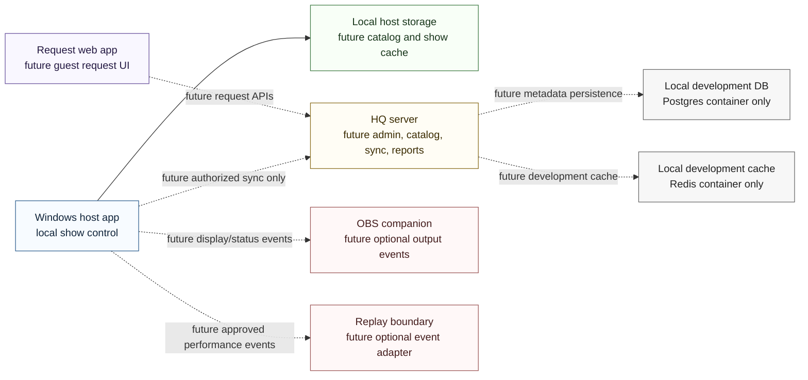

# System Context

Wave 0B defines the boundaries between future components without implementing the components themselves.

## Boundary rules

- The Windows host app remains the live-show authority and must continue operating if HQ, request web, OBS, Replay, or internet access is unavailable.
- HQ server work is future optional support for catalog metadata, synchronization, requests, reports, and administration. Wave 0B adds no HQ API implementation.
- Request web is a future guest-facing surface. Wave 0B adds no mobile request screens or request submission behavior.
- OBS and Replay remain optional event boundaries. Wave 0B defines contract shapes only.
- Local development Postgres and Redis containers are placeholders for future server work and do not include production schemas or migrations.

## Wave 0B limitation

This document is architecture only. It does not start HQ catalog database work, production APIs, Windows host features, playback, synchronization, request screens, OBS integration, or Replay integration.
