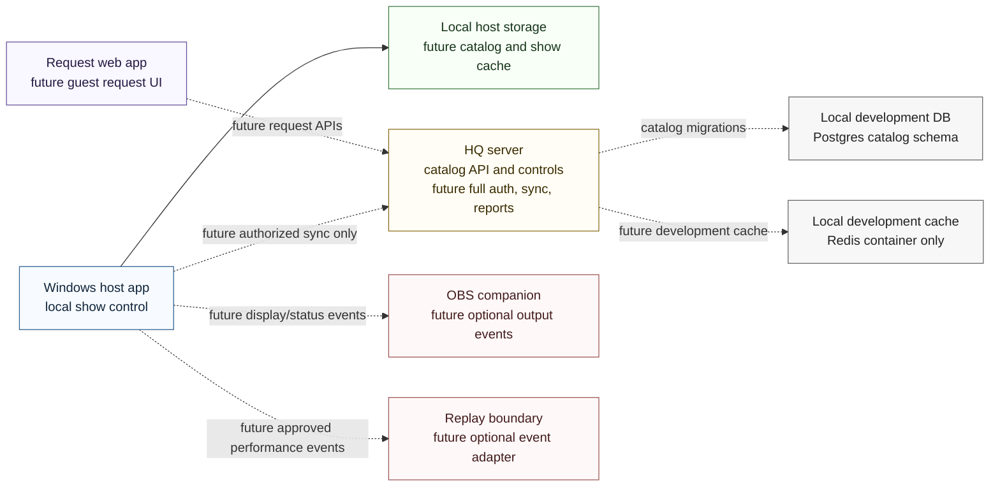

# System Context

Wave 1B keeps the component boundaries and adds HQ catalog reads plus temporary protected catalog-management controls.

## Boundary rules

- The Windows host app remains the live-show authority and must continue operating if HQ, request web, OBS, Replay, or internet access is unavailable.
- HQ server work now includes public catalog health, search, exact-match, song-detail, and alternate-version endpoints plus protected development catalog controls backed by PostgreSQL when `DATABASE_URL` is configured.
- Request web is a future guest-facing surface. Wave 1B adds no mobile request screens or request submission behavior.
- OBS and Replay remain optional event boundaries. Wave 1B adds no implementation for either integration.
- Local development Postgres includes the initial authorized-catalog schema and synthetic seed SQL.

## Wave 1B limitation

This batch does not add full staff authentication, Windows host features, playback, synchronization jobs, request screens, OBS integration, Replay integration, external-source acquisition workflows, real karaoke media, credentials, private URLs, venue network details, or personal singer data.
