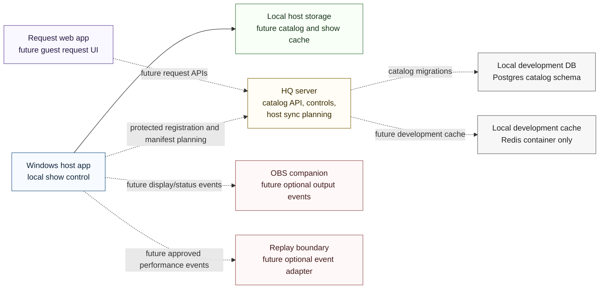

# System Context

Wave 2A keeps the component boundaries and adds HQ-side host registration plus sync-manifest planning while preserving local-first show control.

## Boundary rules

- The Windows host app remains the live-show authority and must continue operating if HQ, request web, OBS, Replay, or internet access is unavailable.
- HQ server work now includes public catalog reads, protected development catalog controls, protected host registration, heartbeat state, admin host status, deterministic host manifests, and review-first manifest diffs backed by PostgreSQL when `DATABASE_URL` is configured.
- Request web is a future guest-facing surface. Wave 2A adds no mobile request screens or request submission behavior.
- OBS and Replay remain optional event boundaries. Wave 2A adds no implementation for either integration.
- Local development Postgres includes authorized-catalog, catalog-controls, host-device, and sync-planning metadata schema with synthetic seed SQL.

## Wave 2A limitation

This batch does not add full staff authentication, host downloading, local file transfer, Windows host UI, playback, synchronization progress/error reporting, cleanup deletion execution, request screens, OBS integration, Replay integration, external-source acquisition workflows, real karaoke media, credentials, private URLs, venue network details, or personal singer data.
